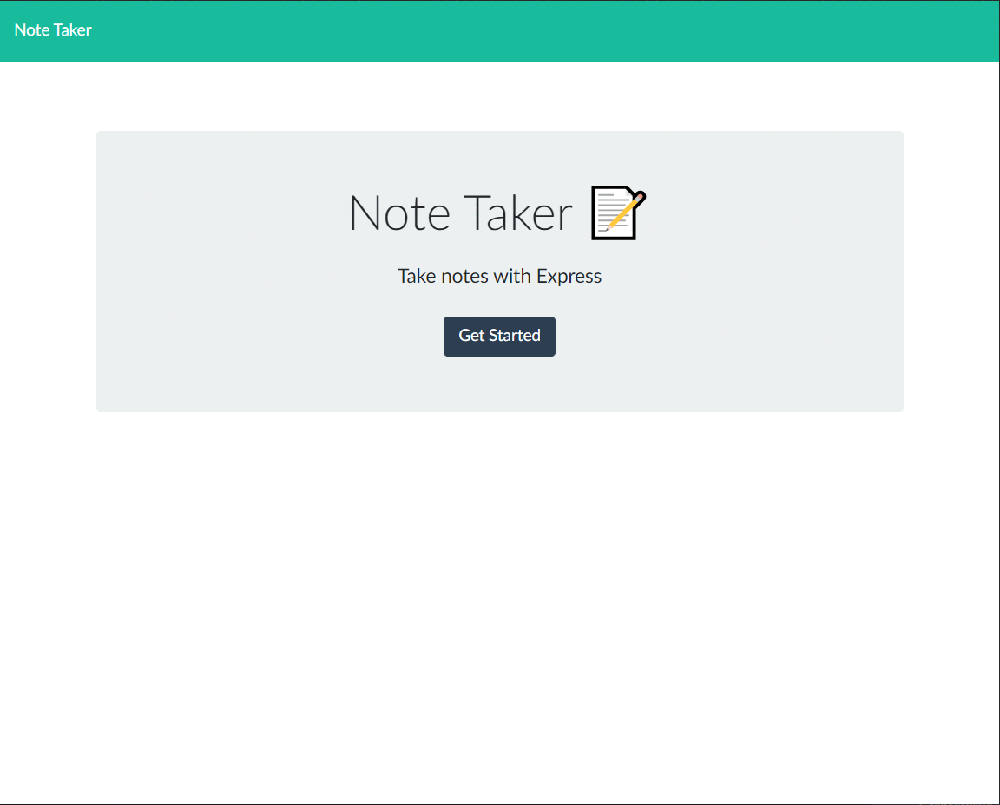

# GT-Homework-11-Note-Taker

A Node CLI that allows users to create, save, view previously saved notes, and delete saved notes.

## Description

The application will let the user enter a note with a title and description. The user can save the note, and view all previously saved notes in a panel on the left side of the screen. The user and view saved notes by selecting a note in the panel, and delete the note by toggling the trash icon for that note in the panel.

## Table of Contents

* [Installation](#installation)
* [Usage](#usage)
* [Contributing](#contributing)
* [Application](#application)
* [Repository](#repository)
* [Questions](#questions)
* [License](#license)

## Installation

Install the necessary dependencies in the command line with:

```sh
npm install
```

## Usage

After dependencies are installed, run the application in the command line with:

```sh
node server.js
```

The following demonstrates application functionality:




## Contributing

None.

## Application

https://blooming-temple-60682.herokuapp.com/

## Repository

[Github Repository](https://github.com/AlanAshworth/GT-Homework-11-Note-Taker)

## Questions


Contact me at <a href="mailto:awashworth927@gmail.com">awashworth927@gmail.com</a>

## License

© 2019 Trilogy Education Services, a 2U, Inc. brand. All Rights Reserved.